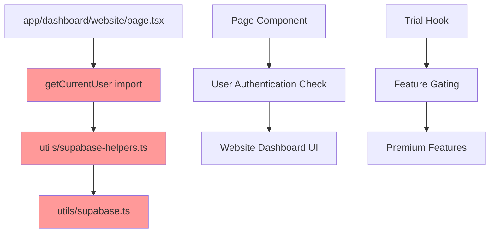
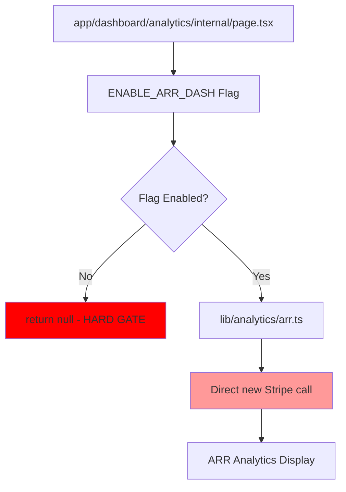
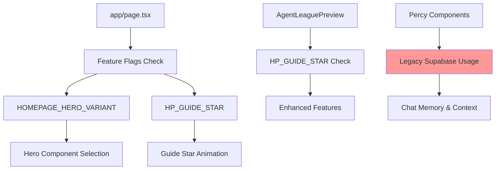
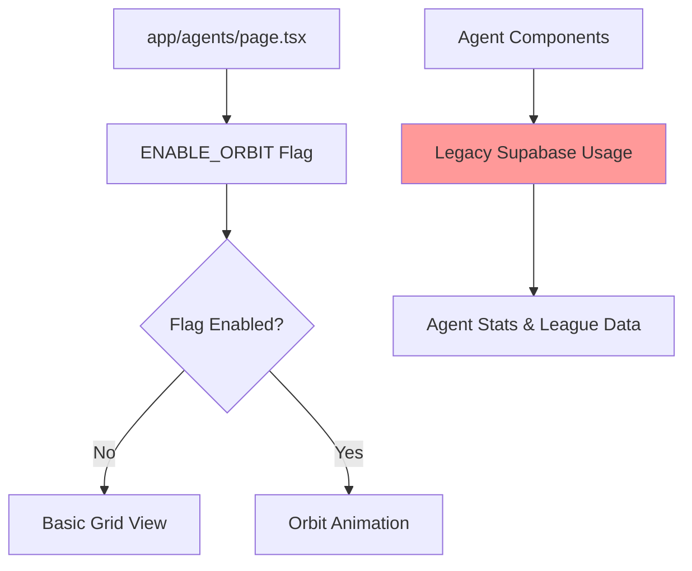
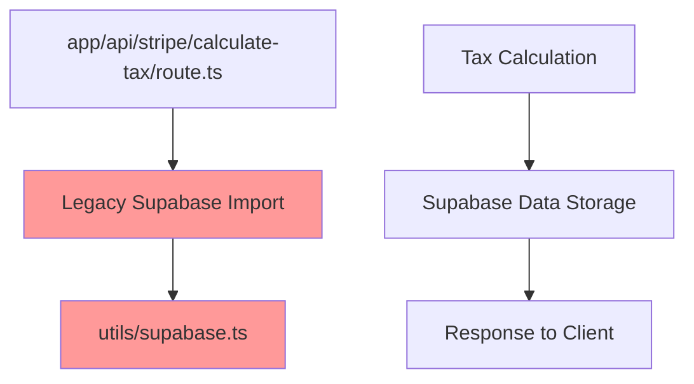
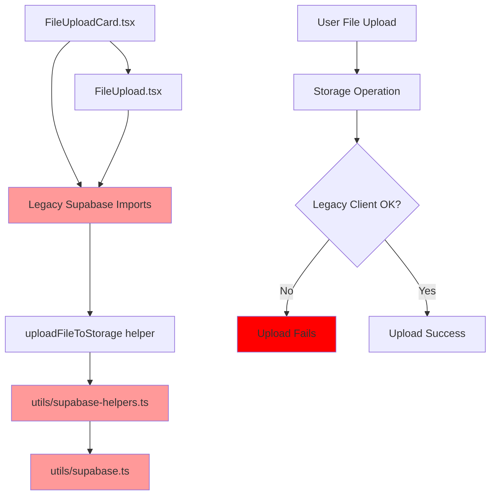
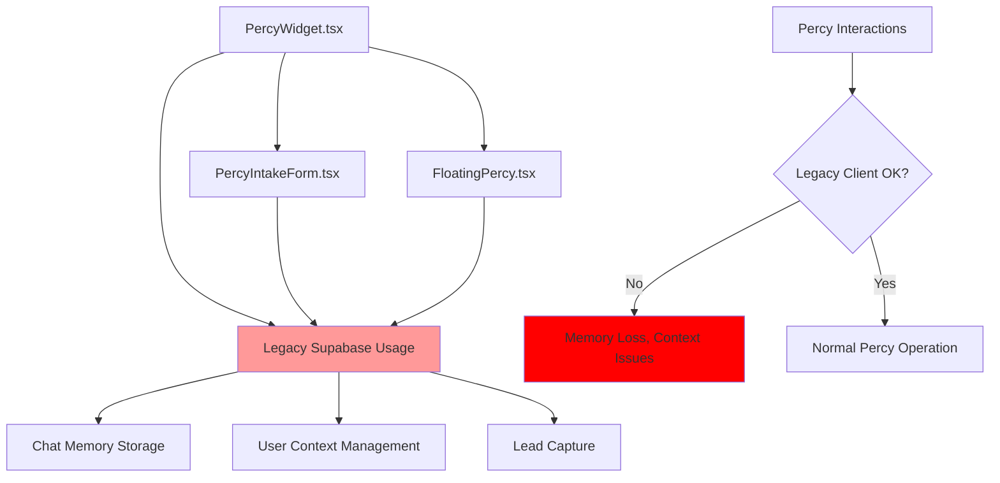
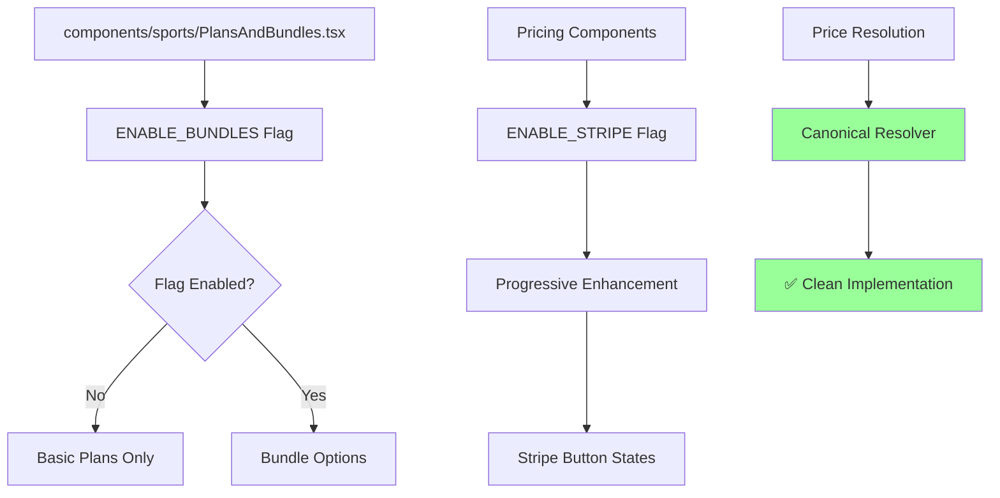

# Route Impact Map - Legacy Usage Tracing

## Executive Summary

This document traces all legacy Supabase and Stripe usage from Tasks 1-2 to their Next.js entry points, showing the complete impact chain from legacy code to user-facing routes.

## Legacy Usage → Route Impact Chains

### 1. Authentication & User Management Routes

#### Core Auth Infrastructure Impact

```mermaid
graph TD
    A[lib/auth/checkUserRole.ts] --> B[All Protected Routes]
    C[hooks/useUser.ts] --> D[Global User Context]
    E[hooks/useTrial.ts] --> F[Dashboard Trial Gates]
    
    B --> G[/dashboard/*]
    B --> H[/agents]
    B --> I[/sports]
    
    D --> J[User-dependent Components]
    F --> K[Trial Status UI]
    
    style A fill:#ff9999
    style C fill:#ff9999
    style E fill:#ff9999
```

**Legacy Files Affecting Auth Routes:**
- `lib/auth/checkUserRole.ts` (utils/supabase import)
  - **Impact**: ALL protected routes
  - **User Visible**: Authentication failures, incorrect role detection
  - **Flag Control**: None - always active

- `hooks/useUser.ts` (utils/supabase import)
  - **Impact**: ALL pages using user context
  - **User Visible**: User state loading issues, profile data errors
  - **Flag Control**: None - global hook

### 2. Dashboard Routes Impact Chain

#### /dashboard/website



**Route**: `/dashboard/website`
**Legacy Chain**: 
1. Page imports `getCurrentUser` from utils/supabase-helpers
2. Helper imports from utils/supabase (legacy client)
3. May fail if legacy client misconfigured

**User Impact**: 
- ❌ Dashboard may not load user data
- ❌ Authentication state may be incorrect
- ❌ Trial status may not display properly

#### /dashboard/getting-started

**Route**: `/dashboard/getting-started`
**Legacy Chain**: Same as website dashboard
**User Impact**: Same authentication and trial issues

#### /dashboard/analytics/internal



**Route**: `/dashboard/analytics/internal`
**Legacy Chain**:
1. Hard gated by `ENABLE_ARR_DASH` flag
2. If enabled, uses `lib/analytics/arr.ts` with direct Stripe instantiation
3. Bypasses canonical `requireStripe()` helper

**User Impact**:
- ❌ **Hard Gate**: Entire page disappears when flag disabled
- ❌ **Legacy Stripe**: Different error handling than other Stripe operations
- ❌ **No Fallback**: Users see blank page instead of "coming soon" message

### 3. Homepage Routes Impact Chain

#### / (Homepage)



**Route**: `/`
**Legacy Chain**:
1. Percy components use legacy Supabase imports
2. Guide star features controlled by flags
3. Hero variant selection via configuration

**User Impact**:
- ⚠️ **Percy Issues**: Chat memory may not save properly
- ✅ **Progressive Enhancement**: Base homepage works even with flags disabled
- ✅ **Fallback UI**: Different hero variants available

### 4. Agent Routes Impact Chain

#### /agents



**Route**: `/agents`
**Legacy Chain**:
1. Uses `hooks/useAgentLeague.ts` and `hooks/useAgentStats.ts`
2. Both hooks import from legacy utils/supabase
3. Orbit animation gated by `ENABLE_ORBIT` flag

**User Impact**:
- ❌ **Agent Data**: Stats and league data may not load correctly
- ✅ **Progressive Enhancement**: Basic grid works without orbit
- ⚠️ **Performance**: Legacy hooks may have different error handling

### 5. API Routes Impact Chain

#### /api/stripe/calculate-tax



**Route**: `/api/stripe/calculate-tax`
**Legacy Chain**:
1. Direct import from `utils/supabase`
2. Used for storing tax calculation results

**User Impact**:
- ❌ **Tax Calculation**: May fail to store results in database
- ❌ **Checkout Flow**: Could break tax calculation step
- ❌ **Error Handling**: Different error patterns than canonical Supabase usage

#### /api/checkout (Clean)

**Route**: `/api/checkout`
**Status**: ✅ **CLEAN** - Uses canonical `requireStripe()`
**User Impact**: No legacy issues detected

#### /api/stripe/webhook (Clean)

**Route**: `/api/stripe/webhook`  
**Status**: ✅ **CLEAN** - Uses canonical patterns
**User Impact**: No legacy issues detected

### 6. Component-Level Impact Chains

#### File Upload Components



**Components**: File upload functionality across dashboard
**Legacy Chain**: Uses legacy Supabase helpers for storage operations
**User Impact**:
- ❌ **File Uploads**: May fail silently or with unclear errors
- ❌ **Dashboard UX**: Broken file management features
- ❌ **Data Loss**: Files may not be properly stored or linked

#### Percy Components



**Components**: Percy AI assistant across multiple pages
**Legacy Chain**: Multiple Percy components use legacy Supabase patterns
**User Impact**:
- ❌ **Chat Memory**: Conversations may not be saved
- ❌ **User Context**: Percy may lose user information
- ❌ **Lead Capture**: Form submissions may fail
- ❌ **Personalization**: Percy may not remember user preferences

### 7. Sports/Pricing Routes Impact Chain

#### /sports



**Route**: `/sports`
**Status**: ✅ **MOSTLY CLEAN** - Uses canonical Stripe patterns
**Legacy Impact**: Minimal - only bundle gating affects pricing options
**User Impact**:
- ✅ **Checkout**: Works correctly with canonical Stripe integration
- ✅ **Price Display**: Uses proper price resolver
- ⚠️ **Bundle Options**: May be hidden based on flag settings

## Risk Assessment by Route

### Critical Risk (Immediate Fix Required)
1. **`/dashboard/analytics/internal`** - Hard gate + legacy Stripe usage
2. **`/api/stripe/calculate-tax`** - Legacy Supabase in payment flow
3. **All dashboard pages** - Legacy auth and user management

### High Risk (Fix Soon)
1. **`/dashboard/website`** - Legacy user data loading
2. **`/dashboard/getting-started`** - Legacy authentication patterns
3. **`/agents`** - Legacy agent data and stats

### Medium Risk (Monitor)
1. **`/` (Homepage)** - Percy components with legacy patterns
2. **File upload functionality** - Storage operations may fail
3. **Percy interactions** - Memory and context issues

### Low Risk (Acceptable)
1. **`/api/checkout`** - Clean canonical implementation
2. **`/api/stripe/webhook`** - Clean canonical implementation
3. **`/sports`** - Mostly clean with proper progressive enhancement

## Flag Control Summary

### Always-On Routes (No Gates) ✅
- `/auth/callback`
- `/api/health/auth` 
- `/api/checkout`
- `/api/stripe/webhook`

### Gated Routes (Potential Issues) ❌
- `/dashboard/analytics/internal` - Hard gated by `ENABLE_ARR_DASH`

### Progressive Enhancement Routes ✅
- `/` - Enhanced features via `HP_GUIDE_STAR`
- `/agents` - Enhanced animations via `ENABLE_ORBIT`
- `/sports` - Bundle options via `ENABLE_BUNDLES`

## Verification Checklist

### Route Functionality
- [ ] All dashboard routes load user data correctly
- [ ] Authentication flows work on all protected routes
- [ ] File uploads work across dashboard components
- [ ] Percy components save memory and context
- [ ] Tax calculation API stores results properly
- [ ] ARR dashboard shows fallback UI when disabled

### Flag Behavior
- [ ] No critical routes are hard-gated
- [ ] Progressive enhancement works as expected
- [ ] Variant selection doesn't break functionality
- [ ] Always-on routes remain accessible regardless of flags

### Error Handling
- [ ] Legacy Supabase errors are handled gracefully
- [ ] Stripe operations use consistent error patterns
- [ ] User-facing errors are informative
- [ ] Fallback UI is shown for disabled features