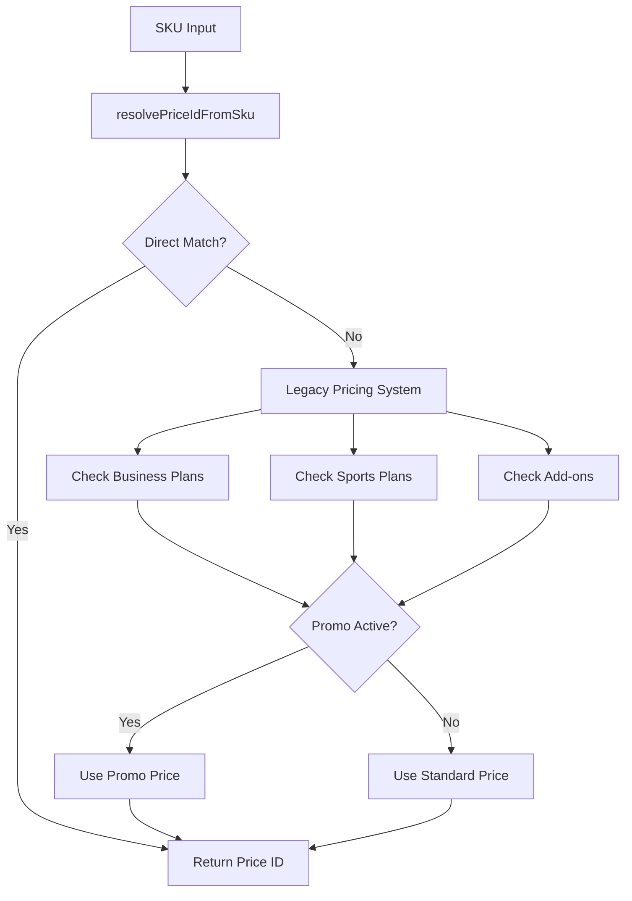

# Stripe Usage Map - Complete Atlas

## Summary Statistics
- **Total Files with Stripe References**: 89
- **Canonical Helper Files**: 2 (`lib/stripe/priceResolver.ts`, `utils/stripe.ts`)
- **API Routes Using Stripe**: 8
- **Components with Stripe Integration**: 12
- **Pricing/SKU Files**: 15
- **Test/Seed Scripts**: 8
- **Environment Variables**: 47+ price IDs

## Canonical Stripe Architecture

### 🏗️ Core Infrastructure

| File | Purpose | Exports | Context | Flag Dependencies |
|------|---------|---------|---------|-------------------|
| `lib/stripe/priceResolver.ts` | **Canonical price resolution** | `resolvePriceIdFromSku`, `getSupportedSkus` | Both | None |
| `utils/stripe.ts` | Stripe client & session management | `getStripePromise`, `stripe`, `createCheckoutSession` | Both | None |
| `lib/stripe/stripe.ts` | Stripe client factory | `requireStripe` | Server | None |

**Environment Variables Required:**
- `NEXT_PUBLIC_STRIPE_PUBLISHABLE_KEY` (client)
- `STRIPE_SECRET_KEY` (server)
- `STRIPE_WEBHOOK_SECRET` (webhooks)

### 🎯 Price Resolution System

The canonical price resolver supports these SKU patterns:

#### Sports Plans
```typescript
// Resolution order: STARTER → SPORTS_STARTER → ROOKIE → _M fallbacks
sports_plan_starter → NEXT_PUBLIC_STRIPE_PRICE_STARTER
sports_plan_pro → NEXT_PUBLIC_STRIPE_PRICE_PRO  
sports_plan_elite → NEXT_PUBLIC_STRIPE_PRICE_ELITE
```

#### Business Plans
```typescript
// Business plans with _M fallback
biz_plan_starter → NEXT_PUBLIC_STRIPE_PRICE_BIZ_STARTER
biz_plan_pro → NEXT_PUBLIC_STRIPE_PRICE_BIZ_PRO
biz_plan_elite → NEXT_PUBLIC_STRIPE_PRICE_BIZ_ELITE
```

#### Add-ons
```typescript
// Sports add-ons
sports_addon_video → NEXT_PUBLIC_STRIPE_PRICE_ADDON_VIDEO
sports_addon_emotion → NEXT_PUBLIC_STRIPE_PRICE_ADDON_EMOTION

// Business add-ons  
biz_addon_adv_analytics → NEXT_PUBLIC_STRIPE_PRICE_BIZ_ADDON_ADV_ANALYTICS
biz_addon_automation → NEXT_PUBLIC_STRIPE_PRICE_BIZ_ADDON_AUTOMATION
```

## API Routes with Stripe Integration

### 🛒 Checkout & Payment Routes

| Route | Purpose | Stripe Usage | Flag Gates | Always Available |
|-------|---------|--------------|------------|------------------|
| `/api/checkout` | **Main checkout endpoint** | Session creation, price resolution | `ENABLE_STRIPE` | ❌ |
| `/api/stripe/webhook` | **Webhook handler** | Event processing, subscription management | None | ✅ |
| `/api/stripe/create-checkout-session` | Legacy checkout | Session creation with tax | None | ❌ |
| `/api/stripe/create-session` | Session creation | Basic session setup | None | ❌ |
| `/api/stripe/calculate-tax` | Tax calculation | Tax computation | None | ❌ |

### 🔍 Route Analysis

#### `/api/checkout` (Primary Endpoint)
```typescript
// File: app/api/checkout/route.ts
// Dependencies: resolvePriceIdFromSku, requireStripe
// Flag Gates: Checks ENABLE_STRIPE via requireStripe()
// Features: Multi-item checkout, add-on support, promo pricing
```

#### `/api/stripe/webhook` (Critical - Never Hidden)
```typescript  
// File: app/api/stripe/webhook/route.ts
// Dependencies: getServerSupabaseAdmin, requireStripe
// Flag Gates: None (always available)
// Features: Subscription lifecycle, payment events, order fulfillment
```

## Component Integration Patterns

### 🎛️ Flag-Gated Components

| Component | Flag Dependency | Behavior When Disabled |
|-----------|-----------------|----------------------|
| `components/pricing/BuyButton.tsx` | `FEATURE_FLAGS.ENABLE_STRIPE` | Shows "Contact Sales" |
| `components/payments/CheckoutButton.tsx` | `FEATURE_FLAGS.ENABLE_STRIPE` | Disables checkout |
| `components/sports/PlansAndBundles.tsx` | `FEATURE_FLAGS.ENABLE_BUNDLES` | Hides bundle options |

### 🚫 Non-Gated Components

| Component | Purpose | Always Renders |
|-----------|---------|---------------|
| `components/skillsmith/SkillSmithProductsGrid.tsx` | Product display | ✅ (UI only) |
| Pricing display components | Price information | ✅ (shows prices) |

## Environment Variable Inventory

### 🔑 Core Stripe Keys

```bash
# Required for all Stripe functionality
NEXT_PUBLIC_STRIPE_PUBLISHABLE_KEY=pk_live_...
STRIPE_SECRET_KEY=sk_live_...
STRIPE_WEBHOOK_SECRET=whsec_...
```

### 💰 Price ID Environment Variables

#### Sports Plans (47 total)
```bash
# Primary resolution paths
NEXT_PUBLIC_STRIPE_PRICE_STARTER=price_...
NEXT_PUBLIC_STRIPE_PRICE_SPORTS_STARTER=price_...
NEXT_PUBLIC_STRIPE_PRICE_ROOKIE=price_...
NEXT_PUBLIC_STRIPE_PRICE_PRO=price_...
NEXT_PUBLIC_STRIPE_PRICE_SPORTS_PRO=price_...
NEXT_PUBLIC_STRIPE_PRICE_ELITE=price_...
NEXT_PUBLIC_STRIPE_PRICE_SPORTS_ELITE=price_...
NEXT_PUBLIC_STRIPE_PRICE_ALLSTAR=price_...

# Monthly variants (_M suffix)
NEXT_PUBLIC_STRIPE_PRICE_STARTER_M=price_...
NEXT_PUBLIC_STRIPE_PRICE_SPORTS_STARTER_M=price_...
NEXT_PUBLIC_STRIPE_PRICE_ROOKIE_M=price_...
# ... (continues for all plans)
```

#### Business Plans
```bash
NEXT_PUBLIC_STRIPE_PRICE_BIZ_STARTER=price_...
NEXT_PUBLIC_STRIPE_PRICE_BIZ_PRO=price_...
NEXT_PUBLIC_STRIPE_PRICE_BIZ_ELITE=price_...
NEXT_PUBLIC_STRIPE_PRICE_BIZ_STARTER_M=price_...
NEXT_PUBLIC_STRIPE_PRICE_BIZ_PRO_M=price_...
NEXT_PUBLIC_STRIPE_PRICE_BIZ_ELITE_M=price_...
```

#### Add-ons
```bash
# Sports Add-ons
NEXT_PUBLIC_STRIPE_PRICE_ADDON_VIDEO=price_...
NEXT_PUBLIC_STRIPE_PRICE_ADDON_EMOTION=price_...
NEXT_PUBLIC_STRIPE_PRICE_ADDON_NUTRITION=price_...
NEXT_PUBLIC_STRIPE_PRICE_ADDON_FOUNDATION=price_...

# Business Add-ons
NEXT_PUBLIC_STRIPE_PRICE_BIZ_ADDON_ADV_ANALYTICS=price_...
NEXT_PUBLIC_STRIPE_PRICE_BIZ_ADDON_AUTOMATION=price_...
NEXT_PUBLIC_STRIPE_PRICE_BIZ_ADDON_TEAM_SEAT=price_...

# Promo variants (_PROMO suffix)
NEXT_PUBLIC_STRIPE_PRICE_ADDON_VIDEO_PROMO=price_...
NEXT_PUBLIC_STRIPE_PRICE_BIZ_ADDON_ADV_ANALYTICS_PROMO=price_...
```

## Feature Flag Integration

### 🎛️ Primary Stripe Flag

```typescript
// lib/config/featureFlags.ts
ENABLE_STRIPE: readBooleanFlag('NEXT_PUBLIC_ENABLE_STRIPE', true)
```

**Impact**: When `ENABLE_STRIPE=false`:
- Checkout buttons show "Contact Sales"
- `/api/checkout` returns error
- Price resolution still works (for display)
- Webhooks remain active (critical for existing subscriptions)

### 🔄 Related Flags

| Flag | Impact on Stripe |
|------|------------------|
| `ENABLE_BUNDLES` | Shows/hides bundle pricing options |
| `ENABLE_LEGACY` | Controls legacy pricing paths |

## Pricing Data Architecture

### 📊 Pricing Configuration Files

| File | Purpose | SKU Coverage |
|------|---------|--------------|
| `lib/business/pricingData.ts` | Business plans & add-ons | `biz_*` SKUs |
| `lib/sports/pricingData.ts` | Sports plans & add-ons | `sports_*` SKUs |
| `lib/pricing/catalogShared.ts` | Shared pricing logic | Promo handling |
| `lib/config/skillsmithPriceMap.ts` | SkillSmith product mapping | Sports products |

### 🔗 Price Resolution Flow



## Database Integration

### 📋 Stripe-Related Tables

| Table | Purpose | Stripe Data Stored |
|-------|---------|-------------------|
| `subscriptions` | Subscription management | `stripe_subscription_id`, status, periods |
| `profiles` | Customer data | `stripe_customer_id` |
| `skillsmith_orders` | Sports purchases | `stripe_session_id`, amounts |
| `payment_events` | Payment tracking | Payment intents, invoice data |

### 🔄 Webhook Event Handling

| Stripe Event | Handler Function | Database Impact |
|--------------|------------------|-----------------|
| `checkout.session.completed` | `handleCheckoutCompleted` | Creates orders/subscriptions |
| `customer.subscription.created` | `handleSubscriptionCreated` | Updates profile, creates subscription |
| `customer.subscription.updated` | `handleSubscriptionUpdated` | Updates subscription status |
| `customer.subscription.deleted` | `handleSubscriptionDeleted` | Marks subscription as canceled |
| `invoice.payment_succeeded` | `handleInvoicePaymentSucceeded` | Records payment event |
| `payment_intent.succeeded` | `handlePaymentIntentSucceeded` | Records one-time payment |

## Testing & Development Tools

### 🧪 Test Scripts

| Script | Purpose | Environment |
|--------|---------|-------------|
| `scripts/test-stripe-resolver.js` | Price resolver testing | Test env vars |
| `scripts/smoke-checkout.ts` | Checkout endpoint testing | Dev server |
| `scripts/seed-stripe-pricing.js` | Stripe product/price creation | Live/Test Stripe |
| `scripts/seed-stripe-business.js` | Business pricing setup | Live/Test Stripe |
| `scripts/seed-stripe-addons.js` | Add-on pricing setup | Live/Test Stripe |

### 🔍 Diagnostic Features

```typescript
// Available diagnostic functions
getSupportedSkus() // Returns all supported SKU patterns
generateResolverParityReport() // Tests all SKU → Price ID mappings
```

## Legacy vs Canonical Usage

### ✅ Canonical Usage (Preferred)

```typescript
// Price resolution
import { resolvePriceIdFromSku } from '@/lib/stripe/priceResolver';
const result = resolvePriceIdFromSku('sports_plan_starter');

// Stripe client
import { requireStripe } from '@/lib/stripe/stripe';
const stripe = requireStripe(); // Handles ENABLE_STRIPE flag

// Checkout
fetch('/api/checkout', {
  method: 'POST',
  body: JSON.stringify({ sku: 'sports_plan_starter' })
});
```

### ⚠️ Legacy Usage (Deprecated)

```typescript
// Direct Stripe client creation (found in some components)
import Stripe from 'stripe';
const stripe = new Stripe(process.env.STRIPE_SECRET_KEY);

// Direct environment variable access
const priceId = process.env.NEXT_PUBLIC_STRIPE_PRICE_STARTER;
```

## Never Hidden Routes

### 🔒 Critical Always-Available Routes

| Route | Purpose | Why Never Hidden |
|-------|---------|------------------|
| `/api/stripe/webhook` | Stripe webhook handler | Existing subscriptions must continue working |

**Verification**: 
- ✅ No feature flag checks in webhook handler
- ✅ Uses `requireStripe()` but doesn't respect `ENABLE_STRIPE` for webhooks
- ✅ Essential for subscription lifecycle management

## Call Graph Summary

```mermaid
graph TD
    A[Frontend Components] --> B[/api/checkout]
    B --> C[resolvePriceIdFromSku]
    B --> D[requireStripe]
    D --> E[stripe.checkout.sessions.create]
    
    F[Stripe Webhooks] --> G[/api/stripe/webhook]
    G --> H[getServerSupabaseAdmin]
    G --> I[Event Handlers]
    
    J[Price Display] --> C
    K[Buy Buttons] --> L{ENABLE_STRIPE?}
    L -->|Yes| B
    L -->|No| M[Contact Sales]
```

## Recommendations

### 🎯 High Priority Actions

1. **Consolidate Price Resolution**: 
   - All components should use `resolvePriceIdFromSku`
   - Deprecate direct env var access

2. **Flag Consistency**:
   - Ensure all Stripe components check `ENABLE_STRIPE`
   - Maintain webhook availability regardless of flag

3. **Environment Variable Audit**:
   - Verify all 47+ price IDs are configured
   - Add validation for missing price mappings

### 🔒 Security & Reliability

1. **Webhook Security**: Ensure webhook signature validation is always active
2. **Error Handling**: Improve error messages for missing price IDs
3. **Idempotency**: Maintain idempotency keys for duplicate prevention

### 📊 Monitoring Opportunities

1. **Price Resolution Success Rate**: Track SKU → Price ID resolution failures
2. **Checkout Conversion**: Monitor checkout session creation vs completion
3. **Webhook Processing**: Track webhook event processing success rates