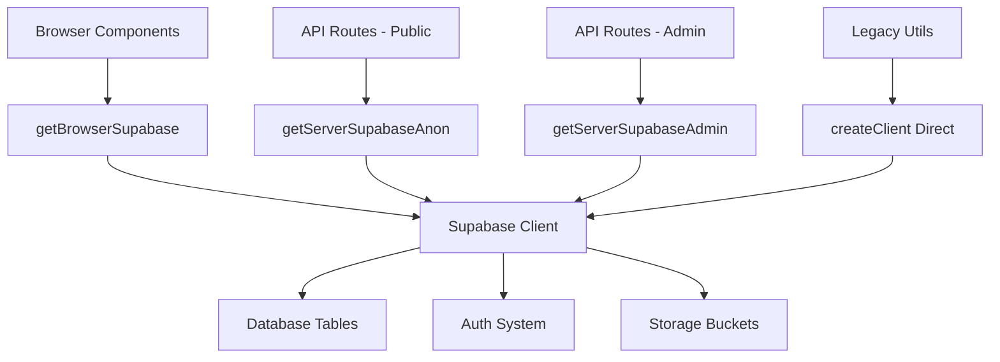

# Supabase Usage Map - Complete Atlas

## Summary Statistics
- **Total Files with Supabase References**: 127
- **Canonical Helper Files**: 3 (`lib/supabase/index.ts`, `client.ts`, `server.ts`)
- **Legacy Helper Files**: 4 (`utils/supabase.ts`, `utils/supabase-helpers.ts`, etc.)
- **API Routes Using Supabase**: 31
- **Components Using Supabase**: 18
- **Test Files**: 8
- **Migration Files**: 6

## Canonical Supabase Architecture

### 🏗️ Core Infrastructure (`lib/supabase/`)

| File | Purpose | Exports | Server/Client | Flag Dependencies |
|------|---------|---------|---------------|-------------------|
| `lib/supabase/index.ts` | **Canonical entry point** | `getBrowserSupabase`, `getServerSupabaseAnon`, `getServerSupabaseAdmin` | Both | None |
| `lib/supabase/client.ts` | Browser client factory | `getBrowserSupabase`, `createSafeSupabaseClient` | Client | None |
| `lib/supabase/server.ts` | Server client factories | `getServerSupabaseAdmin`, `getServerSupabaseAnon` | Server | None |

**Environment Variables Required:**
- `NEXT_PUBLIC_SUPABASE_URL` (client & server)
- `NEXT_PUBLIC_SUPABASE_ANON_KEY` (client & server)
- `SUPABASE_SERVICE_ROLE_KEY` (server admin only)

### 🔄 Legacy Helpers (Deprecated)

| File | Status | Usage Count | Replacement |
|------|--------|-------------|-------------|
| `utils/supabase.ts` | **Legacy** | 12 files | Use `getBrowserSupabase()` |
| `utils/supabase-helpers.ts` | **Legacy** | 3 files | Use canonical clients directly |
| `lib/supabase/browser.ts` | **Duplicate** | 1 file | Use `lib/supabase/client.ts` |

## API Routes with Supabase Integration

### 🔒 Admin Routes (Service Role)

| Route | Purpose | Supabase Usage | Flag Gates |
|-------|---------|----------------|------------|
| `/api/stripe/webhook` | Stripe webhook handler | Admin client for order/subscription management | None |
| `/api/founders/redeem` | Founder code redemption | Admin client for promo code validation | None |
| `/api/auth/dashboard-signin` | Dashboard authentication | Admin client for user lookup | None |
| `/api/analytics/arr` | Revenue analytics | Admin client for financial data | `ENABLE_ARR_DASH` |
| `/api/admin/*` | Admin operations | Admin client for system management | None |

### 🌐 Public Routes (Anon Client)

| Route | Purpose | Supabase Usage | Flag Gates |
|-------|---------|----------------|------------|
| `/api/scan` | Business scanning | Anon client for scan results | None |
| `/api/leads/submit` | Lead capture | Anon client for lead storage | None |
| `/api/contact/submit` | Contact form | Anon client for contact storage | None |
| `/api/percy/scan` | Percy AI scanning | Anon client for scan data | None |
| `/api/analytics/percy` | Percy analytics | Anon client for usage tracking | None |

### 🔍 Health & Status Routes

| Route | Purpose | Flag Dependencies | Always Available |
|-------|---------|-------------------|------------------|
| `/api/health/auth` | Auth system health check | None | ✅ Yes |
| `/api/health` | General health check | None | ✅ Yes |

## Component Usage Patterns

### 🎯 Direct Client Usage

| Component | Import Pattern | Context | Flag Dependencies |
|-----------|----------------|---------|-------------------|
| `components/admin/AccuracyDashboard.tsx` | `createClient(url, key)` | **Legacy Direct** | None |
| `components/admin/RevenueAnalyticsDashboard.tsx` | `createClient(url, key)` | **Legacy Direct** | `ENABLE_ARR_DASH` |
| `app/dashboard/analytics/page.tsx` | `createClient(url, key)` | **Legacy Direct** | None |

**🚨 Refactor Priority**: These should use canonical helpers.

### 📊 Canonical Usage

| Component | Import Pattern | Context | Flag Dependencies |
|-----------|----------------|---------|-------------------|
| `hooks/useUsageBasedPricing.ts` | `createClient(url, key)` | Client | None |
| `lib/analytics/userFunnelTracking.ts` | `createClient(url, key)` | Client | None |

## Database Tables & Operations

### 📋 Core Tables

| Table | Primary Usage | Access Pattern | RLS Enabled |
|-------|---------------|----------------|-------------|
| `profiles` | User management | Admin & Anon | ✅ |
| `leads` | Lead capture | Anon | ✅ |
| `subscriptions` | Stripe integration | Admin | ✅ |
| `skillsmith_orders` | Sports purchases | Admin | ✅ |
| `payment_events` | Payment tracking | Admin | ✅ |
| `system_logs` | System monitoring | Admin | ❌ |
| `percy_logs` | Percy AI logs | Anon | ✅ |
| `agent_activities` | Agent tracking | Anon | ✅ |

### 🔐 Security Patterns

| Operation Type | Client Used | RLS Bypass | Use Case |
|----------------|-------------|------------|----------|
| User registration | Anon | No | Public signup |
| Payment processing | Admin | Yes | Stripe webhooks |
| Lead capture | Anon | No | Marketing forms |
| Analytics queries | Admin | Yes | Internal dashboards |
| Health checks | Admin | Yes | System monitoring |

## Environment Variable Dependencies

### 🌍 Required for All Environments

```bash
# Client-side (exposed to browser)
NEXT_PUBLIC_SUPABASE_URL=https://project.supabase.co
NEXT_PUBLIC_SUPABASE_ANON_KEY=eyJ...

# Server-side (secret)
SUPABASE_SERVICE_ROLE_KEY=eyJ...
```

### 🔄 Alternative Key Support

The system supports dual key lookup:
- `NEXT_PUBLIC_SUPABASE_ANON_KEY` OR `NEXT_PUBLIC_SUPABASE_PUBLISHABLE_KEY`
- `NEXT_PUBLIC_SUPABASE_URL` OR `SUPABASE_URL`

## Feature Flag Integration

### 🎛️ Flag-Gated Features

| Feature | Flag | Impact on Supabase |
|---------|------|-------------------|
| ARR Dashboard | `ENABLE_ARR_DASH` | Enables revenue analytics queries |
| Percy Logging | `PERCY_LOG_SWITCHES` | Controls Percy log verbosity |
| Performance Monitoring | `PERCY_PERFORMANCE_MONITORING` | Enables performance tracking |

### 🚫 Non-Gated Core Features

- User authentication (always available)
- Lead capture (always available)
- Payment webhooks (always available)
- Health checks (always available)

## Migration & Schema Files

| File | Purpose | Status |
|------|---------|--------|
| `supabase/migrations/20251001_rls_perf_fixes.sql` | RLS performance optimization | Active |
| `supabase/migrations/20250927_fix_rls_performance_issues.sql` | RLS performance fixes | Active |
| `supabase/migrations/20250106_analytics_tables.sql` | Analytics schema | Active |
| `supabase/migrations/20250104_promo_vip_system.sql` | VIP/Promo system | Active |
| `supabase/migrations/20250124_skillsmith_tables.sql` | SkillSmith sports orders | Active |

## Edge Functions

| Function | Purpose | Supabase Usage |
|----------|---------|----------------|
| `supabase/functions/post-payment-automation` | Payment processing automation | Full admin access for order management |

## Testing & Diagnostics

### 🧪 Test Coverage

| Test File | Purpose | Mock Strategy |
|-----------|---------|---------------|
| `tests/auth/dashboardAuth.test.ts` | Authentication flow testing | Jest mocks for Supabase client |

### 🔍 Diagnostic Tools

| Script | Purpose | Supabase Integration |
|--------|---------|---------------------|
| `scripts/diagnostics/check-supabase.ts` | Environment validation | Tests connectivity and auth |
| `scripts/test-auth-flow.js` | Auth flow testing | Validates Supabase credentials |

## Call Graph Summary



## Recommendations

### 🎯 High Priority Refactoring

1. **Migrate Legacy Direct Usage**: 
   - `components/admin/AccuracyDashboard.tsx`
   - `components/admin/RevenueAnalyticsDashboard.tsx`
   - `app/dashboard/analytics/page.tsx`

2. **Consolidate Helper Files**:
   - Deprecate `utils/supabase.ts`
   - Migrate to canonical `lib/supabase/index.ts`

3. **Standardize Error Handling**:
   - All clients return `null` on configuration failure
   - Consistent null checks across codebase

### 🔒 Security Improvements

1. **RLS Policy Review**: Ensure all tables have appropriate RLS policies
2. **Service Role Usage Audit**: Verify admin client usage is justified
3. **Environment Variable Validation**: Add runtime checks for required variables

### 📊 Monitoring & Observability

1. **Connection Health**: Monitor Supabase client creation success rates
2. **Query Performance**: Track slow queries and optimize RLS policies
3. **Error Rates**: Monitor authentication and database operation failures