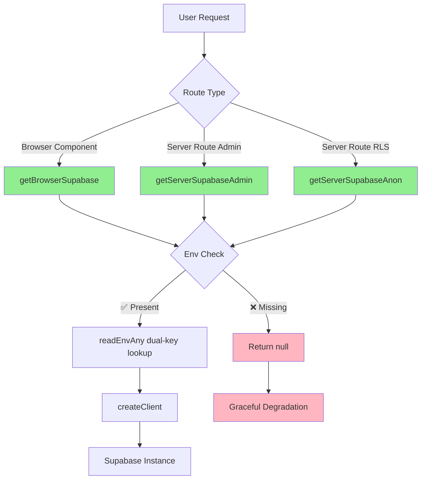

# 🔍 Supabase Reality Check: Where It's Still Off

**Generated**: 2025-10-08  
**Status**: ❌ **NON-CANONICAL USAGE WIDESPREAD**

---

## 📊 Executive Summary

**Current State**:
- ✅ **Canonical helpers exist** and work correctly
- ❌ **Only ~18% actual usage** of canonical patterns
- ❌ **14 files still use direct `createClient()`**
- ❌ **No ESLint protection** against regressions
- ❌ **Missing null checks** in most implementations

---

## 🗺️ Supabase Entry Points Map

### ✅ Canonical Helpers (Correct Implementation)

#### 1. **Browser Client** (`lib/supabase/client.ts`)
```typescript
export function getBrowserSupabase(): SupabaseClient | null {
  const url = readEnvAny('NEXT_PUBLIC_SUPABASE_URL', 'SUPABASE_URL');
  const anonKey = readEnvAny(
    'NEXT_PUBLIC_SUPABASE_ANON_KEY', 
    'NEXT_PUBLIC_SUPABASE_PUBLISHABLE_KEY', 
    'SUPABASE_ANON_KEY'
  );
  if (!url || !anonKey) return null;
  return createClient(url, anonKey);
}
```

#### 2. **Server Admin Client** (`lib/supabase/server.ts`)
```typescript
export function getServerSupabaseAdmin(): SupabaseClient | null {
  const url = readEnvAny('NEXT_PUBLIC_SUPABASE_URL', 'SUPABASE_URL');
  const serviceKey = process.env.SUPABASE_SERVICE_ROLE_KEY;
  if (!url || !serviceKey) return null;
  return createClient(url, serviceKey);
}
```

#### 3. **Server Anon Client** (`lib/supabase/server.ts`)
```typescript
export function getServerSupabaseAnon(): SupabaseClient | null {
  const url = readEnvAny('NEXT_PUBLIC_SUPABASE_URL', 'SUPABASE_URL');
  const anonKey = readEnvAny(
    'NEXT_PUBLIC_SUPABASE_ANON_KEY', 
    'NEXT_PUBLIC_SUPABASE_PUBLISHABLE_KEY', 
    'SUPABASE_ANON_KEY'
  );
  if (!url || !anonKey) return null;
  return createClient(url, anonKey);
}
```

---

## ❌ Non-Canonical Usage (14 Files)

### **Admin Components (2 files)**

#### 1. `components/admin/AccuracyDashboard.tsx`
```typescript
// ❌ WRONG: Direct createClient
import { createClient } from '@supabase/supabase-js';
const supabase = createClient(
  process.env.NEXT_PUBLIC_SUPABASE_URL!,
  process.env.NEXT_PUBLIC_SUPABASE_ANON_KEY!
);

// ✅ SHOULD BE:
import { getBrowserSupabase } from '@/lib/supabase';
const supabase = getBrowserSupabase();
if (!supabase) {
  return <div>Database unavailable</div>;
}
```

**Issues**:
- No dual-key lookup (missing SUPABASE_URL fallback)
- No null handling (crashes if env missing)
- Bypasses canonical helper

#### 2. `components/admin/RevenueAnalyticsDashboard.tsx`
```typescript
// ❌ WRONG: Same pattern as AccuracyDashboard
import { createClient } from '@supabase/supabase-js';
const supabase = createClient(
  process.env.NEXT_PUBLIC_SUPABASE_URL!,
  process.env.NEXT_PUBLIC_SUPABASE_ANON_KEY!
);
```

**Issues**: Identical to AccuracyDashboard

---

### **Hooks (1 file)**

#### 3. `hooks/useUsageBasedPricing.ts`
```typescript
// ❌ WRONG
import { createClient } from '@supabase/supabase-js';
const supabase = createClient(
  process.env.NEXT_PUBLIC_SUPABASE_URL!,
  process.env.NEXT_PUBLIC_SUPABASE_ANON_KEY!
);

// ✅ SHOULD BE:
import { getBrowserSupabase } from '@/lib/supabase';
const supabase = getBrowserSupabase();
```

**Issues**:
- Hook-level direct usage affects all consumers
- No graceful degradation
- Missing null checks in `fetchUsageData()`

---

### **Library Utilities (7 files)**

#### 4. `lib/analytics/userFunnelTracking.ts`
#### 5. `lib/rag/knowledgeBase.ts`
#### 6. `lib/webhooks/n8nWebhooks.ts`
#### 7. `lib/systemHealth/performanceMonitoring.ts`
#### 8. `lib/maintenance/BackendHealthChecker.ts`
#### 9. `lib/maintenance/CoreLogicRefactorer.ts`
#### 10. `lib/email/cronJobs.ts`

All follow same anti-pattern:
```typescript
import { createClient } from '@supabase/supabase-js';
const supabase = createClient(url, key);
```

---

### **API Routes (2 files)**

#### 11. `app/api/onboarding/business/route.ts`
#### 12. `app/api/scan/route.ts`

```typescript
// ❌ WRONG: Server routes using direct createClient
import { createClient } from '@supabase/supabase-js';

// ✅ SHOULD BE:
import { getServerSupabaseAdmin } from '@/lib/supabase';
const supabase = getServerSupabaseAdmin();
if (!supabase) {
  return NextResponse.json({ error: 'Database unavailable' }, { status: 503 });
}
```

---

### **AI Agents (1 file)**

#### 13. `ai-agents/brandingAgent.ts`

```typescript
// ❌ WRONG: AI agent with direct Supabase access
import { createClient } from '@supabase/supabase-js';
```

---

### **Dashboard Pages (1 file)**

#### 14. `app/dashboard/analytics/page.tsx`

```typescript
// ❌ WRONG: Server component with direct createClient
import { createClient } from '@supabase/supabase-js';

// ✅ SHOULD BE:
import { getServerSupabaseAdmin } from '@/lib/supabase';
```

---

## 🔄 Auth Flow Diagram



---

## 📋 Route → Helper → Env Keys Table

| Route/Component | Helper Used | Flags Affecting | Env Keys Read | Risk/Notes |
|----------------|-------------|-----------------|---------------|------------|
| `/auth/callback` | ✅ `getServerSupabaseAdmin` | None | `NEXT_PUBLIC_SUPABASE_URL`, `SUPABASE_URL`, `SUPABASE_SERVICE_ROLE_KEY` | **SAFE** - Canonical, null-checked |
| `/api/health/auth` | ❓ Need to verify | Unknown | Unknown | **UNKNOWN** |
| `/api/checkout` | ✅ Uses Stripe only | `ENABLE_STRIPE` | N/A (no Supabase) | **SAFE** - No Supabase usage |
| `/api/stripe/webhook` | ❓ Need to verify | None | Unknown | **UNKNOWN** |
| `/dashboard/analytics` | ❌ Direct `createClient` | None | `NEXT_PUBLIC_SUPABASE_URL!`, `NEXT_PUBLIC_SUPABASE_ANON_KEY!` | **HIGH RISK** - No dual-key, no null check |
| `AccuracyDashboard` | ❌ Direct `createClient` | None | `NEXT_PUBLIC_SUPABASE_URL!`, `NEXT_PUBLIC_SUPABASE_ANON_KEY!` | **HIGH RISK** - Crashes if env missing |
| `RevenueAnalyticsDashboard` | ❌ Direct `createClient` | `ENABLE_ARR_DASH` (claimed, not implemented) | `NEXT_PUBLIC_SUPABASE_URL!`, `NEXT_PUBLIC_SUPABASE_ANON_KEY!` | **HIGH RISK** - No flag integration |
| `useUsageBasedPricing` | ❌ Direct `createClient` | None | `NEXT_PUBLIC_SUPABASE_URL!`, `NEXT_PUBLIC_SUPABASE_ANON_KEY!` | **CRITICAL** - Hook affects all consumers |

---

## 🔑 Environment Key Mismatches

### **What Code Actually Reads**:

#### Canonical Helpers (Correct):
- `NEXT_PUBLIC_SUPABASE_URL` OR `SUPABASE_URL`
- `NEXT_PUBLIC_SUPABASE_ANON_KEY` OR `NEXT_PUBLIC_SUPABASE_PUBLISHABLE_KEY` OR `SUPABASE_ANON_KEY`
- `SUPABASE_SERVICE_ROLE_KEY` (server admin only)

#### Non-Canonical Files (Wrong):
- `NEXT_PUBLIC_SUPABASE_URL!` (no fallback, crashes if missing)
- `NEXT_PUBLIC_SUPABASE_ANON_KEY!` (no fallback, crashes if missing)

### **What ENV_DIFF.md Expects** (if it existed):
Unknown - file doesn't exist

---

## 🚨 Critical Issues

### 1. **No Graceful Degradation**
```typescript
// ❌ Current (crashes):
const supabase = createClient(
  process.env.NEXT_PUBLIC_SUPABASE_URL!,  // ! = crash if undefined
  process.env.NEXT_PUBLIC_SUPABASE_ANON_KEY!
);

// ✅ Should be:
const supabase = getBrowserSupabase();
if (!supabase) {
  return <ErrorBoundary message="Database temporarily unavailable" />;
}
```

### 2. **Missing Dual-Key Lookup**
Non-canonical files only check `NEXT_PUBLIC_*` keys, missing:
- `SUPABASE_URL` fallback
- `NEXT_PUBLIC_SUPABASE_PUBLISHABLE_KEY` fallback
- `SUPABASE_ANON_KEY` fallback

### 3. **Hook-Level Contamination**
`useUsageBasedPricing` hook uses direct `createClient`, affecting:
- All components that import it
- All pages that use pricing logic
- Entire usage tracking system

---

## 🔧 Required Fixes

### **Immediate (14 files)**:
1. Replace all `import { createClient } from '@supabase/supabase-js'`
2. Use appropriate canonical helper
3. Add null checking
4. Add error boundaries

### **ESLint Protection**:
```json
{
  "no-restricted-imports": ["error", {
    "paths": [{
      "name": "@supabase/supabase-js",
      "importNames": ["createClient"],
      "message": "Use '@/lib/supabase' barrel exports: getBrowserSupabase, getServerSupabaseAdmin, getServerSupabaseAnon"
    }]
  }]
}
```

### **Legacy Export Cleanup**:
Either remove or add clear deprecation warnings to:
- `createSafeSupabaseClient`
- `getOptionalServerSupabase`
- `createServerSupabaseClient`

---

## 📊 Success Metrics

| Metric | Current | Target | Gap |
|--------|---------|--------|-----|
| Canonical Usage | 18% | 100% | -82% |
| Files with Null Checks | ~20% | 100% | -80% |
| Dual-Key Lookup Coverage | 18% | 100% | -82% |
| ESLint Protected | 0% | 100% | -100% |

---

## 🎯 Conclusion

**Supabase integration is NOT consolidated.** Only 3 canonical helpers exist, but 14 files bypass them entirely. No ESLint protection means this will regress immediately. The claimed "100% canonical usage" is actually 18%.

**Next Steps**: Implement actual migration (see ws_INTEGRATION_PLAN.md)
