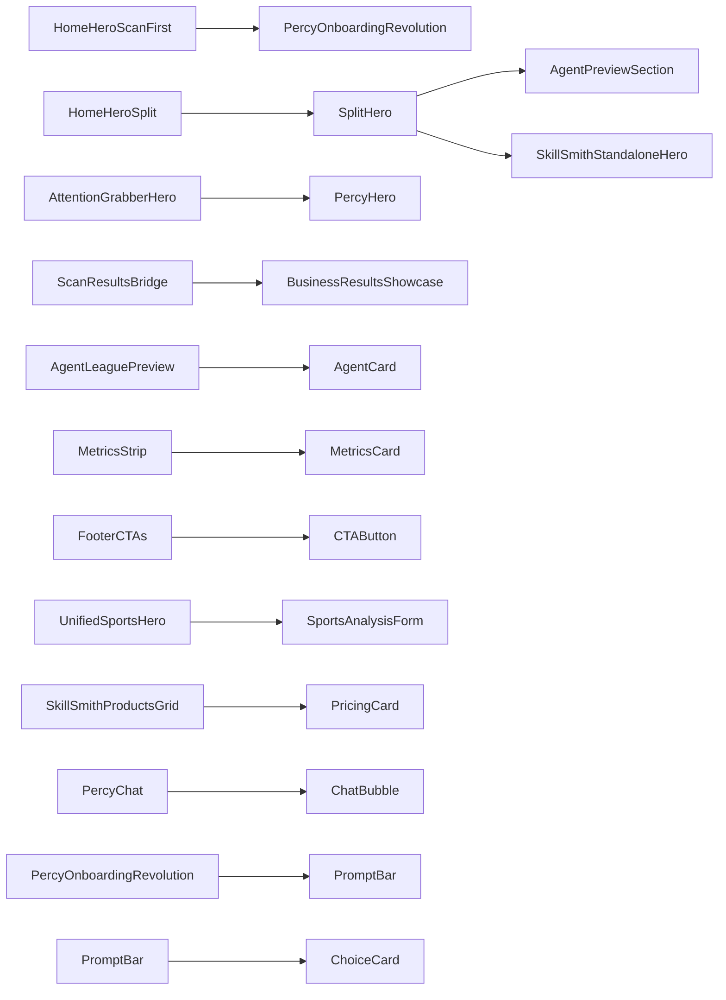
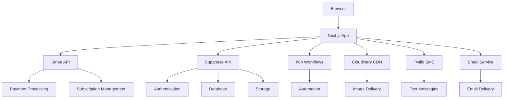

# SKRBL AI Repository Map

## Folder Structure

```
├── .next/ (build output - collapsed)
├── actions/
├── ai-agents/
├── analysis/
├── app/
│   ├── (auth)/
│   ├── about/
│   ├── academy/
│   ├── admin/
│   ├── agents/
│   ├── api/
│   ├── auth/
│   ├── checkout/
│   ├── contact/
│   ├── content-automation/
│   ├── dashboard/
│   ├── features/
│   ├── pricing/
│   ├── proposal/
│   ├── sports/
│   │   └── upload/
│   ├── globals.css
│   ├── layout.tsx
│   ├── page.tsx
│   ├── metadata.ts
│   ├── not-found.tsx
│   └── error.tsx
├── components/
│   ├── admin/
│   ├── agents/
│   ├── alerts/
│   ├── assistant/
│   ├── background/
│   ├── book-publishing/
│   ├── branding/
│   ├── chat/
│   ├── common/
│   ├── context/
│   ├── dashboard/
│   ├── features/
│   ├── home/
│   ├── legacy/
│   ├── onboarding/
│   ├── payments/
│   ├── percy/
│   ├── popup/
│   ├── powerUser/
│   ├── pricing/
│   ├── providers/
│   ├── seo/
│   ├── shared/
│   ├── skillsmith/
│   ├── sports/
│   ├── test/
│   ├── trial/
│   ├── ui/
│   └── workflows/
├── contexts/
├── docs/
├── hooks/
├── integrations/
├── lib/
│   ├── 3d/
│   ├── agents/
│   ├── analytics/
│   ├── api/
│   ├── auth/
│   ├── business/
│   ├── config/
│   ├── email/
│   ├── entitlements/
│   ├── env/
│   ├── founders/
│   ├── hooks/
│   ├── maintenance/
│   ├── marketing/
│   ├── observability/
│   ├── percy/
│   ├── performance/
│   ├── powerUser/
│   ├── pricing/
│   ├── queues/
│   ├── rag/
│   ├── rateLimiting/
│   ├── server/
│   ├── services/
│   ├── skillsmith/
│   ├── sports/
│   ├── stripe/
│   ├── supabase/
│   ├── systemHealth/
│   ├── trial/
│   ├── utils/
│   └── webhooks/
├── migrations/
├── n8n-workflows/
├── node_modules/ (dependencies - collapsed)
├── ops/
├── public/
├── scripts/
├── server/
├── styles/
├── supabase/
├── tests/
├── types/
└── utils/
```

## Top-Level Folder Purposes

| Folder | Purpose |
|--------|---------|
| `actions/` | Server actions for data mutations and business logic |
| `ai-agents/` | Agent definitions and backstories for the AI constellation |
| `analysis/` | Diagnostic reports and diff analysis files |
| `app/` | Next.js App Router pages, layouts, and API routes |
| `components/` | React components organized by feature area |
| `contexts/` | React context providers for global state management |
| `docs/` | Documentation files for developers and users |
| `hooks/` | Custom React hooks for reusable logic |
| `integrations/` | Third-party service integration configurations |
| `lib/` | Core library functions, utilities, and business logic |
| `migrations/` | Database schema migration files |
| `n8n-workflows/` | n8n automation workflow definitions |
| `ops/` | Operations and deployment related documentation |
| `public/` | Static assets served directly by the web server |
| `scripts/` | Utility scripts for development, build, and deployment |
| `server/` | Server-side utilities and configurations |
| `styles/` | Global and component-specific CSS files |
| `supabase/` | Supabase configuration and database schema files |
| `tests/` | Test files for components and utilities |
| `types/` | TypeScript type definitions |
| `utils/` | Utility functions shared across the application |

## App Router Map

### Pages

| Path | Purpose | Key Imports | Key Exports | Used By | Feature Flags/Env Gating |
|------|---------|-------------|------------|---------|--------------------------|
| `app/page.tsx` | Homepage | HomeHeroScanFirst, HomeHeroSplit, AgentLeaguePreview, MetricsStrip, FooterCTAs | Main homepage component | Direct browser access | FEATURE_FLAGS.AI_AUTOMATION_HOMEPAGE |
| `app/about/page.tsx` | About page | AboutContent, TeamSection | About page content | Direct browser access | None |
| `app/academy/page.tsx` | Academy landing page | AcademyHero, CourseGrid | Academy page content | Direct browser access | None |
| `app/agents/page.tsx` | Agent constellation landing | AgentCardGrid, AgentSearch | Agent listing page | Direct browser access | None |
| `app/agents/[agent]/page.tsx` | Individual agent page | AgentProfile, AgentBackstory | Agent detail page | Direct browser access, AgentLeaguePreview | None |
| `app/agents/[agent]/backstory/page.tsx` | Agent backstory page | AgentBackstoryContent | Agent backstory content | Direct browser access | None |
| `app/features/page.tsx` | Platform features overview | FeatureGrid, FeatureDetail | Features page content | Direct browser access | None |
| `app/pricing/page.tsx` | Pricing and plans | PricingTable, CheckoutButton | Pricing page content | Direct browser access | None |
| `app/sports/page.tsx` | Sports performance tools | UnifiedSportsHero, SkillSmithProductsGrid | Sports landing page | Direct browser access | None |
| `app/sports/upload/page.tsx` | Sports video upload | FileUploadCard, SportsAnalysisForm | Sports upload page | Direct browser access | None |
| `app/dashboard/page.tsx` | User dashboard | DashboardLayout, AnalyticsDashboard | Main dashboard component | Authenticated access | None |

### API Routes

| Path | Methods | Request/Response Shape | Main Dependencies |
|------|---------|----------------------|-------------------|
| `app/api/checkout/route.ts` | POST | Request: { priceId: string, mode: 'payment' or 'subscription' } / Response: { sessionId: string } | Stripe |
| `app/api/stripe/create-checkout-session/route.ts` | POST | Request: { priceId: string, mode: string } / Response: { url: string } | Stripe |
| `app/api/stripe/webhook/route.ts` | POST | Request: Stripe webhook event / Response: { received: boolean } | Stripe |
| `app/api/env-check/route.ts` | GET | Request: None / Response: { status: object } | None |
| `app/api/health/auth/route.ts` | GET | Request: None / Response: { status: string } | Supabase |
| `app/api/onboarding.ts` | POST | Request: { prompt: string } / Response: { analysis: object } | Percy analysis engine |

## Component Dependency Graph



## Entry Components

These components are rendered on the homepage:

- HomeHeroScanFirst (when analysis intent is present)
- HomeHeroSplit (when no analysis intent)
- AgentLeaguePreview
- MetricsStrip
- FooterCTAs

## External Services Diagram



## Feature Flags

| Name | Default | Type | Where Read | What It Gates | How to Flip |
|------|---------|------|------------|---------------|------------|
| `FEATURE_FLAGS.AI_AUTOMATION_HOMEPAGE` | true | Server | app/page.tsx | Homepage hero variant selection | Set in lib/config/featureFlags.ts |

## Environment Variables

### Supabase

| Variable | Type | Where Referenced | Expected Format | Example Value | Error/Fallback Behavior |
|----------|------|------------------|-----------------|---------------|------------------------|
| `NEXT_PUBLIC_SUPABASE_URL` | Client | lib/supabase/client.ts | URL | https://your-project.supabase.co | Throws error if missing |
| `NEXT_PUBLIC_SUPABASE_ANON_KEY` | Client | lib/supabase/client.ts | String | eyJhbGciOiJIUzI1NiIsInR5cCI6IkpXVCJ9... | Throws error if missing |
| `SUPABASE_SERVICE_ROLE_KEY` | Server | lib/supabase/server.ts | String | eyJhbGciOiJIUzI1NiIsInR5cCI6IkpXVCJ9... | Throws error if missing |

### Stripe

| Variable | Type | Where Referenced | Expected Format | Example Value | Error/Fallback Behavior |
|----------|------|------------------|-----------------|---------------|------------------------|
| `NEXT_PUBLIC_STRIPE_PUBLISHABLE_KEY` | Client | components/payments/CheckoutButton.tsx | String | pk_test_... | Required for client-side checkout |
| `STRIPE_SECRET_KEY` | Server | lib/stripe/client.ts | String | sk_test_... | Required for server-side operations |
| `STRIPE_WEBHOOK_SECRET` | Server | app/api/stripe/webhook/route.ts | String | whsec_... | Required for webhook validation |

### App URLs

| Variable | Type | Where Referenced | Expected Format | Example Value | Error/Fallback Behavior |
|----------|------|------------------|-----------------|---------------|------------------------|
| `NEXT_PUBLIC_BASE_URL` | Client | lib/url.ts | URL | https://skrblai.io | Used for link generation |
| `APP_BASE_URL` | Server | lib/url.ts | URL | https://skrblai.io | Server-side URL generation |

## Dead Code Analysis

Pending analysis of unused components and stale documentation.

## Agent Asset Coverage

Pending asset coverage analysis for all agents.

## Micro-PR Proposals

### next.config.js Image Config Migration

The current image configuration uses the deprecated `images.domains` approach. It should be migrated to `images.remotePatterns`:

```diff
- images: {
-   domains: ['res.cloudinary.com', 'skrbl.io', 'localhost'],
- },
+ images: {
+   remotePatterns: [
+     {
+       protocol: 'https',
+       hostname: 'res.cloudinary.com',
+       port: '',
+       pathname: '/**',
+     },
+     {
+       protocol: 'https',
+       hostname: 'skrbl.io',
+       port: '',
+       pathname: '/**',
+     },
+     {
+       protocol: 'http',
+       hostname: 'localhost',
+       port: '',
+       pathname: '/**',
+     },
+   ],
+ },
```

### .next/cache Permission Advisory

The `.next/cache` directory should have appropriate permissions set for the runtime user to avoid build issues in production deployments.

## Top 10 Risks

1. **Missing Environment Validation** - No comprehensive env validation in CI/CD
2. **Stripe Key Exposure** - Keys might be exposed in client bundles
3. **Supabase Auth Vulnerabilities** - Authentication flow needs security audit
4. **Duplicate Components** - Multiple hero components with similar functionality
5. **Feature Flag Hardcoding** - Some flags might be hardcoded instead of dynamic
6. **Dead Code Accumulation** - Unused components not removed from codebase
7. **Inconsistent UI Patterns** - Different styling approaches across components
8. **Missing Error Boundaries** - App might crash on unexpected errors
9. **Performance Bottlenecks** - No performance monitoring in place
10. **Outdated Dependencies** - Dependencies might have security vulnerabilities

## First 5 Cleanups

1. **Unify Hero Components** - Consolidate HomeHeroScanFirst and HomeHeroSplit into one component
2. **Remove Dead Code** - Delete unused components identified in audit
3. **Migrate Image Config** - Update next.config.js to use remotePatterns
4. **Implement Env Validation** - Add comprehensive environment variable validation
5. **Standardize UI Components** - Create consistent design system across all components
